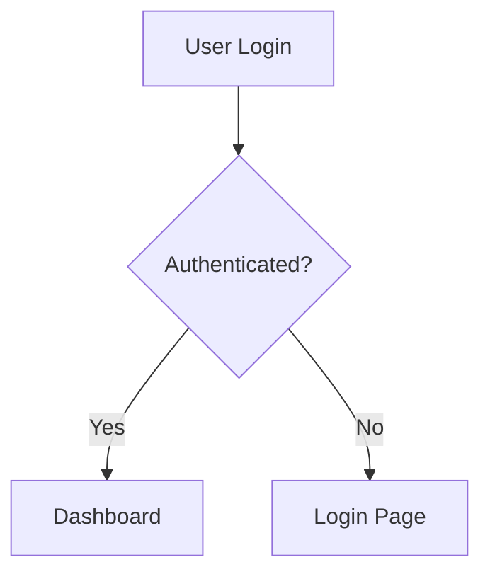

# **Documentation Standards**

## **Purpose**
Provide clear guidelines for creating, organizing, and maintaining project documentation to ensure consistency and discoverability.
Agents must follow these standards and avoid creating unecessary documentation.
Agents must maintain a single source of truth for each topic.
Agents must avoid duplicating information across multiple documents.
Agents must use links to reference related documentation instead of copying content.

## **Documentation Structure**

### **Primary Documentation Locations**

```
docs/
  ├── architecture/      # System design and technical decisions
  ├── api/              # API documentation and integration guides
  ├── features/         # Feature specifications and user guides
  ├── database/         # Schema docs, migrations, and data models
  ├── setup/            # Installation and configuration guides
  └── guides/           # How-to guides and tutorials
```

### **Location Guidelines**

**Architecture Documentation** (`docs/architecture/`)
- System design decisions
- Technology stack rationale
- Infrastructure diagrams
- Security architecture
- Multi-tenancy implementation

**API Documentation** (`docs/api/`)
- Supabase function references
- REST endpoint documentation
- Authentication flows
- Rate limiting and quotas
- Error codes and handling

**Feature Documentation** (`docs/features/`)
- Feature specifications
- User stories and requirements
- Business logic explanations
- Workflow diagrams
- User interface mockups

**Database Documentation** (`docs/database/`)
- Schema diagrams
- Table relationships (ERD)
- Migration guides
- RLS policies explanation
- Indexing strategy

**Setup Documentation** (`docs/setup/`)
- Environment setup
- Local development guide
- Deployment procedures
- Configuration options
- Troubleshooting common issues

**How-To Guides** (`docs/guides/`)
- Step-by-step tutorials
- Common task workflows
- Best practices
- Code examples
- FAQ section

## **Documentation Format Standards**

### **File Naming Convention**
- Use kebab-case: `user-authentication.md`
- Be descriptive: `bom-calculation-logic.md` not `calc.md`
- Add date for dated docs: `2024-01-migration-guide.md`

### **Markdown Structure**

Every documentation file should follow this template:

```markdown
# Title (H1 - One per document)

Brief overview paragraph explaining what this document covers.

## Overview (H2)
High-level context and purpose.

## Prerequisites (if applicable)
What the reader needs before following this guide.

## Main Content Sections (H2)
### Subsections (H3)
#### Details (H4 - use sparingly)

## Examples
Practical code examples with explanations.

## Common Issues
Known problems and solutions.

## Related Documentation
Links to other relevant docs.

---
*Last updated: YYYY-MM-DD*
*Author: Name/Team*
```

### **Content Guidelines**

**Be Concise**
- Start with the most important information
- Use bullet points for lists
- Keep paragraphs short (3-5 sentences)

**Be Specific**
- Provide actual examples, not placeholders
- Use real file paths from the project
- Include concrete values in configuration examples

**Be Current**
- Add date stamps to time-sensitive information
- Mark deprecated features clearly
- Update docs when code changes

**Use Visual Aids**
- Add diagrams for complex flows
- Use code blocks with syntax highlighting
- Include screenshots for UI features

### **Code Block Standards**

Always specify the language:
````typescript
// Good - with language and context
```typescript
// src/services/auth.ts
export const login = async (email: string, password: string) => {
  // Implementation
};
```
````

Always include file paths in code comments:
```typescript
// filepath: src/components/InventoryList.tsx
export const InventoryList = () => {
  // Component code
};
```

### **Diagram Standards**

Use Mermaid for diagrams when possible:

````markdown

````

For complex diagrams, use:
- Draw.io (export as SVG)
- Excalidraw (export as PNG)
- Store images in `docs/assets/images/`

## **Documentation Workflow**

### **When to Create Documentation**

**Always Document:**
- ✅ New features before implementation
- ✅ Complex business logic
- ✅ Breaking changes
- ✅ API endpoints and contracts
- ✅ Database schema changes
- ✅ Deployment procedures

**Consider Documenting:**
- 🤔 Helper functions with complex logic
- 🤔 Performance optimizations
- 🤔 Third-party integrations
- 🤔 Configuration options

**Don't Document:**
- ❌ Self-explanatory code
- ❌ Standard patterns (use code comments instead)
- ❌ Temporary workarounds (use TODO comments)

### **Review Checklist**

Before committing documentation:
- [ ] Title clearly describes the content
- [ ] Overview paragraph provides context
- [ ] Code examples are tested and work
- [ ] File paths and references are accurate
- [ ] Links to related docs are included
- [ ] Last updated date is current
- [ ] Spelling and grammar checked
- [ ] Follows the project's formatting standards

## **Special Documentation Types**

### **ADR (Architecture Decision Records)**
Location: `docs/architecture/decisions/`

Template:
```markdown
# ADR-001: [Decision Title]

**Date:** YYYY-MM-DD
**Status:** Proposed | Accepted | Deprecated | Superseded

## Context
What is the issue we're addressing?

## Decision
What did we decide?

## Consequences
What are the trade-offs?

## Alternatives Considered
What else did we look at?
```

### **API Documentation**
Location: `docs/api/`

Include:
- Endpoint URL
- HTTP method
- Request parameters
- Request body schema
- Response format
- Error responses
- Example requests/responses
- Authentication requirements

### **Feature Specs**
Location: `docs/features/`

Include:
- User story
- Business requirements
- Technical requirements
- UI/UX considerations
- Data model changes
- API changes
- Testing criteria

## **Inline Code Documentation**

### **Component Documentation**
```typescript
/**
 * InventoryList - Displays paginated inventory items with filtering
 * 
 * @component
 * @example
 * ```tsx
 * <InventoryList 
 *   organizationId="123"
 *   onItemSelect={(item) => console.log(item)}
 * />
 * ```
 */
export const InventoryList = ({ organizationId, onItemSelect }: Props) => {
  // Implementation
};
```

### **Complex Logic Comments**
```typescript
// Calculate weighted average cost using FIFO method
// Required for compliance with GAAP accounting standards
const calculateAverageCost = (transactions: Transaction[]) => {
  // Sort by date ascending (oldest first)
  const sortedTx = [...transactions].sort((a, b) => 
    a.date.getTime() - b.date.getTime()
  );
  // ...implementation
};
```

## **Documentation Maintenance**

### **Regular Reviews**
- Quarterly: Review all setup and installation docs
- Per release: Update API and feature documentation
- Per schema change: Update database documentation

### **Deprecation Process**
1. Mark as deprecated with clear notice
2. Add migration guide to replacement
3. Set removal date
4. Remove after grace period

Example:
```markdown
# ⚠️ DEPRECATED: Old Authentication Flow

**Deprecated:** 2024-01-15
**Removed:** 2024-04-15
**Replacement:** See [New Auth System](./new-auth.md)

This authentication method is no longer supported...
```

## **AI Agent Guidelines**

When creating documentation:
1. **Determine the correct location** using the structure above
2. **Use the appropriate template** for the document type
3. **Include working code examples** from the actual project
4. **Link related documentation** to improve discoverability
5. **Keep it simple** - avoid overengineering docs like code
6. **Update existing docs** rather than creating duplicates

**Remember:** Good documentation is discoverable, accurate, and maintainable. Write for your future self and new team members.

---
*Last updated: 2024-01-15*